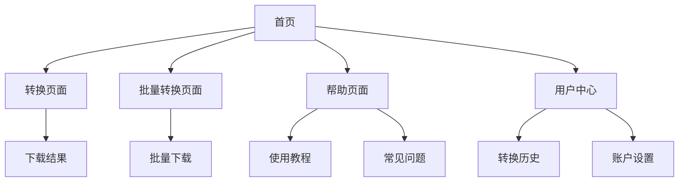

# SVG转ICO工具产品需求文档

## 1. 产品概述

本产品是一个专注于SVG到ICO格式转换的在线工具，旨在为开发者、设计师和网站管理员提供快速、高质量的图标转换服务。产品解决了用户在创建网站favicon、应用图标时需要将SVG矢量图转换为ICO格式的核心需求，通过简单易用的界面和强大的转换功能，帮助用户快速完成图标制作流程。

目标市场价值：随着网站和应用开发的持续增长，图标转换工具市场预计将保持稳定增长，我们的产品将专注于SVG转ICO这一细分领域，提供最优质的用户体验。

## 2. 核心功能

### 2.1 用户角色

| 角色 | 注册方式 | 核心权限 |
|------|----------|----------|
| 访客用户 | 无需注册 | 可使用基础转换功能，单次转换1个文件 |
| 注册用户 | 邮箱注册 | 可批量转换，保存转换历史，自定义输出尺寸 |

### 2.2 功能模块

我们的SVG转ICO工具包含以下主要页面：

1. **首页**：产品介绍、快速转换入口、功能特色展示
2. **转换页面**：文件上传、转换设置、实时预览、下载功能
3. **批量转换页面**：多文件上传、批量处理、打包下载
4. **帮助页面**：使用教程、常见问题、格式说明
5. **用户中心**：转换历史、账户设置、使用统计

### 2.3 页面详情

| 页面名称 | 模块名称 | 功能描述 |
|----------|----------|----------|
| 首页 | Hero区域 | 展示产品核心价值，包含快速转换入口和主要功能介绍 |
| 首页 | 功能特色 | 突出产品优势：免费使用、高质量转换、支持多尺寸、批量处理 |
| 首页 | 使用步骤 | 简单3步操作指南：上传SVG → 选择设置 → 下载ICO |
| 转换页面 | 文件上传区 | 支持拖拽上传、点击选择，实时文件预览和格式验证 |
| 转换页面 | 转换设置 | 自定义输出尺寸（16x16, 32x32, 48x48, 64x64），质量选择 |
| 转换页面 | 实时预览 | 显示原始SVG和转换后ICO的对比效果 |
| 转换页面 | 下载功能 | 单文件下载，支持不同尺寸的ICO文件 |
| 批量转换页面 | 多文件管理 | 批量上传SVG文件，文件列表管理，进度显示 |
| 批量转换页面 | 批量设置 | 统一应用转换参数，批量处理进度跟踪 |
| 批量转换页面 | 打包下载 | 将所有转换结果打包为ZIP文件下载 |
| 帮助页面 | 使用教程 | 详细的操作指南和最佳实践建议 |
| 帮助页面 | 格式说明 | SVG和ICO格式的技术说明，支持的特性介绍 |
| 帮助页面 | 常见问题 | FAQ解答，故障排除指南 |
| 用户中心 | 转换历史 | 显示用户的转换记录，支持重新下载 |
| 用户中心 | 账户设置 | 个人信息管理，偏好设置 |

## 3. 核心流程

### 访客用户流程
用户访问首页 → 点击快速转换 → 上传SVG文件 → 选择输出设置 → 预览效果 → 下载ICO文件

### 注册用户流程
用户登录 → 选择单个或批量转换 → 上传文件 → 自定义转换参数 → 开始转换 → 预览和下载 → 保存到转换历史

## 4. 用户界面设计

### 4.1 设计风格

- **主色调**：#3B82F6（现代蓝色）作为主色，#10B981（绿色）作为成功状态色
- **辅助色**：#6B7280（中性灰）用于文本，#F3F4F6（浅灰）用于背景
- **按钮样式**：圆角设计（8px），渐变效果，悬停状态变化
- **字体**：Inter字体系列，标题使用24-32px，正文使用14-16px
- **布局风格**：卡片式设计，顶部导航栏，响应式网格布局
- **图标风格**：使用Heroicons图标库，简洁线性风格

### 4.2 页面设计概览

| 页面名称 | 模块名称 | UI元素 |
|----------|----------|--------|
| 首页 | Hero区域 | 大标题渐变文字，CTA按钮使用主色调，背景采用几何图案 |
| 首页 | 功能特色 | 3列网格布局，每个特色配图标，卡片阴影效果 |
| 转换页面 | 上传区域 | 虚线边框拖拽区，上传图标，进度条动画 |
| 转换页面 | 设置面板 | 滑块控件，复选框组，实时预览窗口 |
| 批量转换页面 | 文件列表 | 表格布局，进度指示器，状态标签 |
| 帮助页面 | 内容区域 | 左侧导航，右侧内容，代码高亮显示 |

### 4.3 响应式设计

产品采用移动优先的响应式设计策略，确保在桌面端、平板和手机上都有良好的用户体验。针对触屏设备优化了按钮大小和交互方式，支持手势操作如拖拽上传。

## 5. 竞品分析总结

### 5.1 主要竞品

1. **CloudConvert** - 综合性文件转换平台，支持SVG转ICO
2. **Convertio** - 在线转换工具，提供多种格式支持
3. **Favicon.io** - 专注于favicon生成和转换
4. **PicFlow** - 图像转换工具，强调无广告体验
5. **RealFaviconGenerator** - 专业的favicon生成器

### 5.2 竞品优势分析

- **CloudConvert**：支持格式最全面，API接口完善
- **Favicon.io**：专注favicon场景，用户体验简洁
- **PicFlow**：强调隐私保护，本地处理
- **RealFaviconGenerator**：提供完整的favicon解决方案

### 5.3 竞品劣势分析

- 大多数工具功能过于复杂，学习成本高
- 部分工具存在文件大小限制
- 转换质量参差不齐，缺乏专业优化
- 用户界面老旧，移动端体验差
- 缺乏中文支持和本土化服务

## 6. 产品机会方向

### 6.1 差异化优势

1. **专业专注**：专门针对SVG转ICO场景深度优化
2. **质量保证**：采用先进算法确保转换质量
3. **用户体验**：现代化界面设计，操作简单直观
4. **本土化服务**：提供中文界面和客服支持
5. **性能优化**：快速转换，支持大文件处理

### 6.2 目标用户群体

- **Web开发者**：需要为网站创建favicon
- **UI/UX设计师**：制作应用图标和界面元素
- **产品经理**：快速制作产品原型图标
- **个人博主**：为个人网站定制图标
- **小型企业**：制作品牌相关图标

### 6.3 市场机会

1. **SEO优势**：专注"svg to ico"关键词，容易获得搜索排名
2. **技术趋势**：SVG格式使用越来越广泛
3. **市场空白**：缺乏专业的SVG转ICO工具
4. **用户痛点**：现有工具复杂度高，转换质量不稳定

### 6.4 发展策略

1. **第一阶段**：建立基础转换功能，获取初始用户
2. **第二阶段**：增加高级功能，如批量处理、API接口
3. **第三阶段**：扩展到其他图标相关工具，建立工具矩阵
4. **第四阶段**：提供企业级服务，开发付费功能

## 7. SEO策略

### 7.1 核心关键词

- 主关键词："svg to ico", "svg转ico"
- 长尾关键词："svg to ico converter", "在线svg转ico", "免费svg转ico工具"
- 相关关键词："favicon generator", "图标转换器", "ico文件制作"

### 7.2 内容策略

1. **技术博客**：发布SVG和ICO格式相关的技术文章
2. **使用教程**：详细的操作指南和最佳实践
3. **案例分析**：展示成功的转换案例和效果对比
4. **工具对比**：与竞品的功能和质量对比

### 7.3 技术SEO

1. **页面速度优化**：确保快速加载
2. **移动端适配**：响应式设计
3. **结构化数据**：添加Schema标记
4. **内链建设**：合理的页面链接结构

## 8. 成功指标

### 8.1 用户指标

- 月活跃用户数（MAU）
- 转换成功率
- 用户留存率
- 平均会话时长

### 8.2 业务指标

- 搜索引擎排名位置
- 有机流量增长
- 转换量（文件处理数）
- 用户满意度评分

### 8.3 技术指标

- 页面加载速度
- 转换处理时间
- 系统可用性
- 错误率

通过以上产品规划，我们将打造一个专业、易用、高质量的SVG转ICO工具，在竞争激烈的在线工具市场中建立独特的竞争优势。