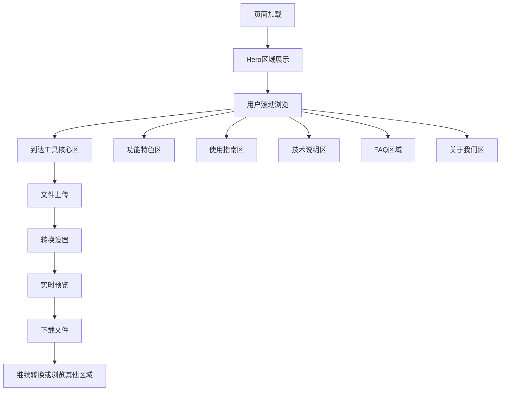

# SVG转ICO工具单页面精品设计方案

## 1. 产品概述

本产品是一个专注于SVG到ICO格式转换的单页面精品工具，将核心转换功能与传统落地页的各个板块完美融合。用户可以在同一页面内完成从了解产品到使用工具的完整流程，提供极致的用户体验和最高的转换效率。

产品核心理念：**一页即全部** - 用户无需跳转页面，在首页即可完成所有操作，同时获得完整的产品信息和使用指导。

## 2. 核心功能

### 2.1 用户角色

| 角色 | 使用方式 | 核心权限 |
|------|----------|----------|
| 访客用户 | 直接使用 | 可使用完整转换功能，无限制使用 |
| 高级用户 | 可选注册 | 保存转换历史，批量下载，个性化设置 |

### 2.2 单页面功能模块

我们的SVG转ICO精品工具页面包含以下核心板块：

1. **Hero区域**：品牌展示、核心价值主张、快速转换入口
2. **工具核心区**：文件上传、转换设置、实时预览、下载功能
3. **功能特色区**：产品优势展示、技术亮点说明
4. **使用指南区**：简单步骤说明、最佳实践建议
5. **技术说明区**：格式介绍、转换原理、质量保证
6. **FAQ区域**：常见问题解答、故障排除
7. **关于我们区**：团队介绍、联系方式、技术支持

### 2.3 页面详情

| 板块名称 | 模块名称 | 功能描述 |
|----------|----------|----------|
| Hero区域 | 主标题区 | 突出"SVG to ICO Converter"核心功能，包含SEO优化的标题和描述 |
| Hero区域 | CTA按钮 | "Start Converting Now"大按钮，直接滚动到工具区域 |
| 工具核心区 | 文件上传 | 拖拽上传SVG文件，支持多文件选择，实时预览 |
| 工具核心区 | 转换设置 | 输出尺寸选择（16x16到512x512），质量设置，背景颜色选项 |
| 工具核心区 | 实时预览 | 原始SVG与转换后ICO的并排对比显示 |
| 工具核心区 | 下载区域 | 单个/批量下载按钮，支持ZIP打包，转换历史 |
| 功能特色区 | 优势展示 | 免费使用、高质量转换、隐私保护、快速处理等特点 |
| 功能特色区 | 技术亮点 | 先进算法、多尺寸支持、批量处理、本地转换等 |
| 使用指南区 | 步骤说明 | 3步操作流程：Upload → Configure → Download |
| 使用指南区 | 最佳实践 | SVG文件准备建议、尺寸选择指导、质量优化技巧 |
| 技术说明区 | 格式介绍 | SVG和ICO格式的详细说明，适用场景介绍 |
| 技术说明区 | 转换原理 | 算法说明、质量保证机制、性能优化策略 |
| FAQ区域 | 常见问题 | 支持的文件格式、大小限制、质量问题、下载问题等 |
| FAQ区域 | 故障排除 | 上传失败、转换错误、下载问题的解决方案 |
| 关于我们区 | 团队介绍 | 开发团队背景、技术实力、产品愿景 |
| 关于我们区 | 联系支持 | 邮箱联系、反馈渠道、技术支持方式 |

## 3. 核心流程

### 用户操作流程
用户访问页面 → 浏览产品介绍 → 滚动到工具区域 → 上传SVG文件 → 调整转换设置 → 实时预览效果 → 下载ICO文件 → 查看使用指南（可选） → 了解更多功能（可选）

### 页面交互流程


## 4. 用户界面设计

### 4.1 设计风格

- **主色调**：#2563EB（专业蓝色）作为主色，#059669（成功绿色）作为辅助色
- **辅助色**：#64748B（中性灰）用于文本，#F8FAFC（极浅灰）用于背景
- **按钮样式**：现代圆角设计（12px），渐变效果，微动画反馈
- **字体**：Inter字体系列，Hero标题48px，板块标题32px，正文16px
- **布局风格**：垂直滚动式单页设计，卡片式模块，流畅的视觉层次
- **图标风格**：Lucide React图标库，一致的线性风格，24px标准尺寸

### 4.2 页面设计概览

| 板块名称 | 模块名称 | UI元素 |
|----------|----------|--------|
| Hero区域 | 主视觉 | 渐变背景，大标题动画，CTA按钮悬浮效果，几何装饰元素 |
| 工具核心区 | 上传区域 | 虚线边框拖拽区，上传动画，文件预览卡片，进度指示器 |
| 工具核心区 | 设置面板 | 滑块控件，单选按钮组，颜色选择器，实时预览窗口 |
| 工具核心区 | 下载区域 | 下载按钮组，文件列表，批量操作，成功状态提示 |
| 功能特色区 | 特色卡片 | 3列网格布局，图标+标题+描述，悬浮阴影效果 |
| 使用指南区 | 步骤展示 | 数字标识，箭头连接，步骤卡片，动画演示 |
| 技术说明区 | 内容展示 | 左右分栏布局，代码示例，技术图表，折叠面板 |
| FAQ区域 | 问答列表 | 手风琴式展开，搜索功能，分类标签，快速定位 |
| 关于我们区 | 团队展示 | 头像网格，联系卡片，社交链接，简洁布局 |

### 4.3 响应式设计

产品采用移动优先的响应式设计，确保在所有设备上的完美体验：

- **桌面端（≥1024px）**：多列布局，侧边固定导航，大尺寸预览
- **平板端（768px-1023px）**：两列布局，折叠导航，中等尺寸预览
- **手机端（<768px）**：单列布局，底部固定工具栏，全屏预览
- **触屏优化**：大按钮设计，手势支持，触觉反馈

## 5. 技术实现要点

### 5.1 页面结构

```
单页面布局结构：
├── Header（固定顶部导航）
├── Hero Section（英雄区域）
├── Tool Core Section（工具核心区）
├── Features Section（功能特色区）
├── Guide Section（使用指南区）
├── Technical Section（技术说明区）
├── FAQ Section（常见问题区）
├── About Section（关于我们区）
└── Footer（页脚信息）
```

### 5.2 核心功能实现

1. **文件上传**：使用react-dropzone，支持拖拽和点击上传
2. **SVG转换**：客户端JavaScript处理，保护用户隐私
3. **实时预览**：Canvas API渲染，即时显示转换效果
4. **批量处理**：Web Workers后台处理，不阻塞UI
5. **文件下载**：Blob API生成文件，支持单个和批量下载

### 5.3 性能优化

1. **懒加载**：非核心区域内容延迟加载
2. **图片优化**：WebP格式，响应式图片
3. **代码分割**：按需加载组件和功能
4. **缓存策略**：静态资源缓存，转换结果本地存储

## 6. SEO优化策略

### 6.1 页面SEO

- **标题优化**："SVG to ICO Converter - Free Online Tool | Convert SVG to ICO"
- **描述优化**：包含核心关键词的自然描述
- **结构化数据**：WebApplication Schema标记
- **语义化HTML**：正确的标签层次和语义

### 6.2 内容SEO

- **关键词密度**：自然分布"svg to ico"相关关键词
- **长尾关键词**：覆盖"free svg to ico converter"等长尾词
- **内容质量**：提供有价值的使用指南和技术说明
- **用户体验**：快速加载，易用界面，低跳出率

### 6.3 技术SEO

- **页面速度**：Core Web Vitals优化
- **移动友好**：移动端完美适配
- **可访问性**：WCAG 2.1 AA标准
- **国际化**：多语言支持，hreflang标记

## 7. 用户体验亮点

### 7.1 交互体验

1. **一键到达**：Hero区域CTA按钮直接滚动到工具区
2. **拖拽上传**：直观的文件拖拽体验
3. **实时反馈**：转换过程的即时视觉反馈
4. **批量操作**：支持多文件同时处理
5. **快速下载**：一键下载或批量打包

### 7.2 视觉体验

1. **流畅动画**：页面滚动和元素交互动画
2. **视觉层次**：清晰的信息架构和视觉引导
3. **品牌一致性**：统一的色彩和字体系统
4. **现代设计**：简洁、专业、易用的界面

### 7.3 功能体验

1. **零学习成本**：直观的操作流程
2. **高质量输出**：专业级的转换质量
3. **隐私保护**：本地处理，不上传服务器
4. **跨平台兼容**：支持所有现代浏览器

## 8. 成功指标

### 8.1 用户指标

- **页面停留时间**：目标 > 3分钟
- **转换完成率**：目标 > 85%
- **用户满意度**：目标 > 4.5/5
- **重复使用率**：目标 > 30%

### 8.2 业务指标

- **搜索排名**："svg to ico"关键词前3位
- **有机流量**：月增长率 > 20%
- **转换量**：日均转换 > 1000次
- **分享率**：用户主动分享 > 5%

### 8.3 技术指标

- **页面加载速度**：LCP < 2.5秒
- **转换处理时间**：平均 < 3秒
- **移动端性能**：Performance Score > 90
- **可用性**：99.9%正常运行时间

## 9. 开发优先级

### 第一阶段：核心功能（MVP）
1. 基础页面结构和Hero区域
2. 文件上传和SVG转换核心功能
3. 基础的转换设置和下载功能
4. 响应式布局适配

### 第二阶段：体验优化
1. 实时预览功能
2. 批量处理能力
3. 功能特色和使用指南区域
4. 动画和交互优化

### 第三阶段：内容完善
1. 技术说明和FAQ区域
2. 多语言支持
3. SEO优化和性能调优
4. 用户反馈和数据分析

### 第四阶段：高级功能
1. 用户系统和转换历史
2. 高级转换选项
3. API接口开发
4. 企业级功能扩展

通过这个单页面精品设计方案，我们将打造一个集工具功能与产品展示于一体的完美用户体验，让用户在一个页面内就能完成从了解到使用的全部流程，真正实现"一页即全部"的产品理念。