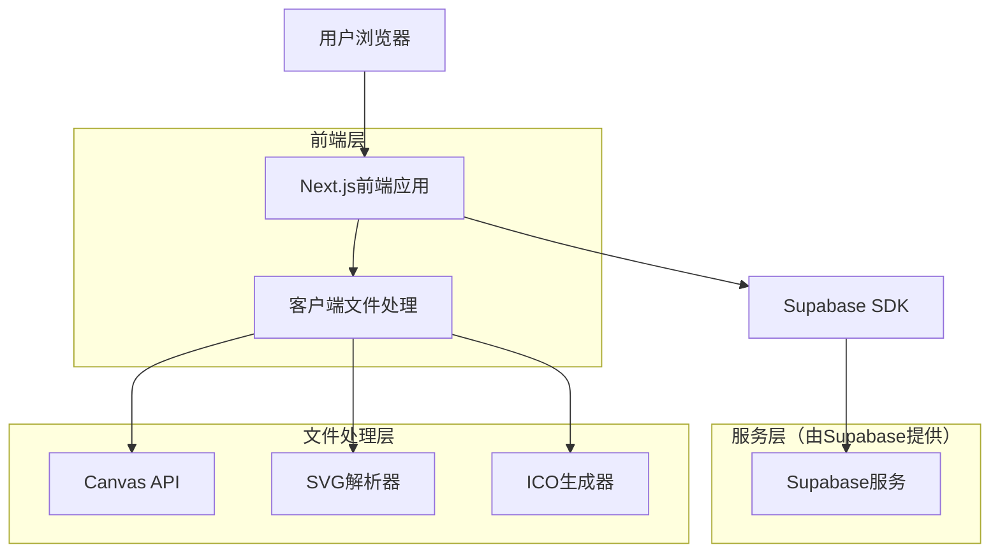
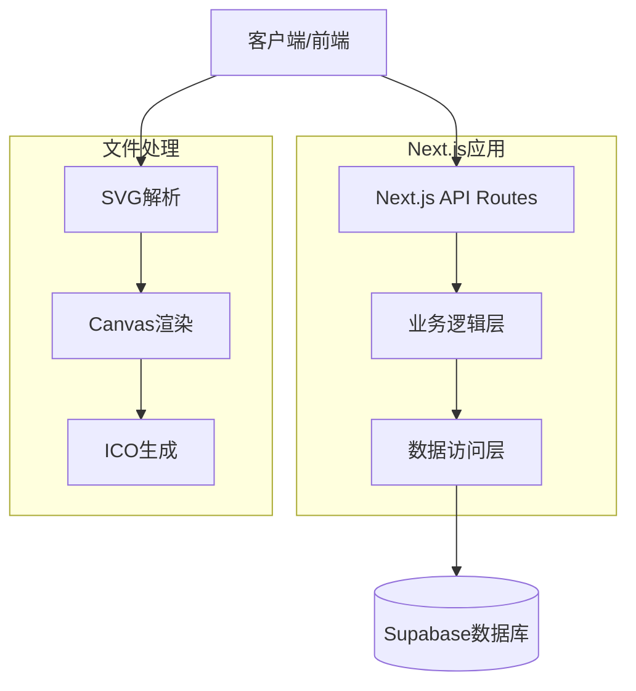

# SVG转ICO工具技术架构文档

## 1. 架构设计



## 2. 技术描述

- **前端**: Next.js@14 + React@18 + TypeScript + Tailwind CSS@3 + Shadcn/ui
- **文件处理**: Canvas API + 自定义SVG解析 + ICO格式生成
- **状态管理**: Zustand（轻量级状态管理）
- **数据存储**: Supabase（用户数据、转换历史）
- **部署**: Vercel（与Next.js完美集成）

## 3. 路由定义

基于单页面设计，应用采用简化的路由结构：

| 路由 | 用途 |
|------|------|
| / | 主页面，包含所有功能模块和内容板块 |
| /[locale] | 多语言支持的主页面（如 /en, /zh 等） |
| /#hero | Hero区域锚点 |
| /#tool | 工具核心区域锚点 |
| /#features | 功能特色区域锚点 |
| /#guide | 使用指南区域锚点 |
| /#faq | FAQ区域锚点 |
| /#about | 关于我们区域锚点 |

## 4. API定义

### 4.1 核心API

**文件转换相关**
```typescript
// 客户端转换接口
interface ConversionOptions {
  sizes: number[]; // [16, 32, 48, 64]
  quality: 'low' | 'medium' | 'high';
  backgroundColor?: string;
}

interface ConversionResult {
  success: boolean;
  files: {
    size: number;
    blob: Blob;
    dataUrl: string;
  }[];
  error?: string;
}

// 转换函数
function convertSvgToIco(
  svgFile: File, 
  options: ConversionOptions
): Promise<ConversionResult>
```

**用户认证相关（Supabase）**
```typescript
// 用户注册
interface SignUpData {
  email: string;
  password: string;
  name: string;
}

// 用户登录
interface SignInData {
  email: string;
  password: string;
}

// 用户信息
interface User {
  id: string;
  email: string;
  name: string;
  created_at: string;
  conversion_count: number;
}
```

**转换历史相关**
```typescript
// 保存转换记录
interface ConversionRecord {
  id: string;
  user_id: string;
  original_filename: string;
  file_size: number;
  conversion_options: ConversionOptions;
  created_at: string;
  download_count: number;
}

// API端点
POST /api/conversions/save
GET /api/conversions/history
DELETE /api/conversions/{id}
```

### 4.2 示例请求响应

**保存转换记录**
```json
// 请求
{
  "original_filename": "logo.svg",
  "file_size": 2048,
  "conversion_options": {
    "sizes": [16, 32, 48],
    "quality": "high"
  }
}

// 响应
{
  "success": true,
  "record_id": "uuid-string",
  "message": "转换记录已保存"
}
```

## 5. 服务器架构图



## 6. 数据模型

### 6.1 数据模型定义

基于单页面应用的简化数据模型：


### 6.2 数据定义语言

基于单页面应用的数据库表结构：

**用户表 (users)**
```sql
-- 创建用户表
CREATE TABLE users (
    id UUID PRIMARY KEY DEFAULT gen_random_uuid(),
    email VARCHAR(255) UNIQUE NOT NULL,
    name VARCHAR(100) NOT NULL,
    created_at TIMESTAMP WITH TIME ZONE DEFAULT NOW(),
    updated_at TIMESTAMP WITH TIME ZONE DEFAULT NOW(),
    conversion_count INTEGER DEFAULT 0
);

-- 创建转换历史表
CREATE TABLE conversion_history (
    id UUID PRIMARY KEY DEFAULT gen_random_uuid(),
    user_id UUID REFERENCES users(id) ON DELETE CASCADE,
    original_filename VARCHAR(255) NOT NULL,
    file_size VARCHAR(50) NOT NULL,
    conversion_settings JSONB NOT NULL,
    download_url TEXT,
    created_at TIMESTAMP WITH TIME ZONE DEFAULT NOW()
);

-- 创建用户偏好表
CREATE TABLE user_preferences (
    id UUID PRIMARY KEY DEFAULT gen_random_uuid(),
    user_id UUID UNIQUE REFERENCES users(id) ON DELETE CASCADE,
    theme VARCHAR(20) DEFAULT 'system' CHECK (theme IN ('light', 'dark', 'system')),
    language VARCHAR(10) DEFAULT 'en' CHECK (language IN ('en', 'zh', 'es', 'fr')),
    default_settings JSONB DEFAULT '{}',
    updated_at TIMESTAMP WITH TIME ZONE DEFAULT NOW()
);

-- 创建索引
CREATE INDEX idx_users_email ON users(email);
CREATE INDEX idx_users_created_at ON users(created_at DESC);
CREATE INDEX idx_conversion_history_user_id ON conversion_history(user_id);
CREATE INDEX idx_conversion_history_created_at ON conversion_history(created_at DESC);
CREATE INDEX idx_user_preferences_user_id ON user_preferences(user_id);

-- 设置RLS (Row Level Security)
ALTER TABLE users ENABLE ROW LEVEL SECURITY;
ALTER TABLE conversion_history ENABLE ROW LEVEL SECURITY;
ALTER TABLE user_preferences ENABLE ROW LEVEL SECURITY;

-- 创建RLS策略
CREATE POLICY "Users can view own data" ON users FOR SELECT USING (auth.uid() = id);
CREATE POLICY "Users can update own data" ON users FOR UPDATE USING (auth.uid() = id);
CREATE POLICY "Users can view own conversion history" ON conversion_history FOR SELECT USING (auth.uid() = user_id);
CREATE POLICY "Users can insert own conversion history" ON conversion_history FOR INSERT WITH CHECK (auth.uid() = user_id);
CREATE POLICY "Users can view own preferences" ON user_preferences FOR SELECT USING (auth.uid() = user_id);
CREATE POLICY "Users can update own preferences" ON user_preferences FOR ALL USING (auth.uid() = user_id);

-- 授权给anon和authenticated角色
GRANT SELECT ON users TO anon, authenticated;
GRANT ALL ON conversion_history TO authenticated;
GRANT ALL ON user_preferences TO authenticated;

-- 初始化数据（示例）
INSERT INTO conversion_history (user_id, original_filename, file_size, conversion_settings)
VALUES 
('example-user-id', 'sample-logo.svg', '2KB', '{"sizes": [16, 32, 48], "quality": "high"}');
```

## 7. 核心技术实现

### 7.1 SVG转ICO核心算法

```typescript
// 核心转换逻辑
class SvgToIcoConverter {
  private canvas: HTMLCanvasElement;
  private ctx: CanvasRenderingContext2D;
  
  constructor() {
    this.canvas = document.createElement('canvas');
    this.ctx = this.canvas.getContext('2d')!;
  }
  
  async convertSvgToIco(
    svgContent: string, 
    options: ConversionOptions
  ): Promise<ConversionResult> {
    const results: ConversionResult['files'] = [];
    
    try {
      // 解析SVG
      const svgBlob = new Blob([svgContent], { type: 'image/svg+xml' });
      const svgUrl = URL.createObjectURL(svgBlob);
      
      // 为每个尺寸生成ICO
      for (const size of options.sizes) {
        const icoBlob = await this.renderSvgToIco(svgUrl, size, options);
        results.push({
          size,
          blob: icoBlob,
          dataUrl: URL.createObjectURL(icoBlob)
        });
      }
      
      URL.revokeObjectURL(svgUrl);
      
      return { success: true, files: results };
    } catch (error) {
      return { 
        success: false, 
        files: [], 
        error: error instanceof Error ? error.message : '转换失败' 
      };
    }
  }
  
  private async renderSvgToIco(
    svgUrl: string, 
    size: number, 
    options: ConversionOptions
  ): Promise<Blob> {
    return new Promise((resolve, reject) => {
      const img = new Image();
      img.onload = () => {
        // 设置画布尺寸
        this.canvas.width = size;
        this.canvas.height = size;
        
        // 清空画布
        this.ctx.clearRect(0, 0, size, size);
        
        // 设置背景色（如果指定）
        if (options.backgroundColor) {
          this.ctx.fillStyle = options.backgroundColor;
          this.ctx.fillRect(0, 0, size, size);
        }
        
        // 绘制SVG
        this.ctx.drawImage(img, 0, 0, size, size);
        
        // 转换为ICO格式的Blob
        this.canvas.toBlob((blob) => {
          if (blob) {
            resolve(blob);
          } else {
            reject(new Error('无法生成ICO文件'));
          }
        }, 'image/x-icon', this.getQualityValue(options.quality));
      };
      
      img.onerror = () => reject(new Error('SVG加载失败'));
      img.src = svgUrl;
    });
  }
  
  private getQualityValue(quality: ConversionOptions['quality']): number {
    switch (quality) {
      case 'low': return 0.6;
      case 'medium': return 0.8;
      case 'high': return 1.0;
      default: return 0.8;
    }
  }
}
```

### 7.2 文件处理组件

```typescript
// 文件上传和处理组件
interface FileUploadProps {
  onFileSelect: (file: File) => void;
  accept?: string;
  maxSize?: number;
}

const FileUpload: React.FC<FileUploadProps> = ({
  onFileSelect,
  accept = '.svg',
  maxSize = 5 * 1024 * 1024 // 5MB
}) => {
  const [isDragOver, setIsDragOver] = useState(false);
  
  const handleDrop = useCallback((e: React.DragEvent) => {
    e.preventDefault();
    setIsDragOver(false);
    
    const files = Array.from(e.dataTransfer.files);
    const svgFile = files.find(file => file.type === 'image/svg+xml');
    
    if (svgFile && svgFile.size <= maxSize) {
      onFileSelect(svgFile);
    }
  }, [onFileSelect, maxSize]);
  
  return (
    <div
      className={`border-2 border-dashed rounded-lg p-8 text-center transition-colors ${
        isDragOver ? 'border-blue-500 bg-blue-50' : 'border-gray-300'
      }`}
      onDrop={handleDrop}
      onDragOver={(e) => {
        e.preventDefault();
        setIsDragOver(true);
      }}
      onDragLeave={() => setIsDragOver(false)}
    >
      <Upload className="mx-auto h-12 w-12 text-gray-400" />
      <p className="mt-2 text-sm text-gray-600">
        拖拽SVG文件到此处，或点击选择文件
      </p>
    </div>
  );
};
```

## 8. 性能优化策略

### 8.1 前端优化

1. **代码分割**: 使用Next.js动态导入，按需加载组件
2. **图片优化**: 使用Next.js Image组件，自动优化图片
3. **缓存策略**: 利用浏览器缓存和Service Worker
4. **懒加载**: 非关键组件延迟加载

### 8.2 转换性能优化

1. **Web Workers**: 将转换任务移到后台线程
2. **批量处理**: 优化批量转换的内存使用
3. **进度反馈**: 实时显示转换进度
4. **错误处理**: 完善的错误恢复机制

### 8.3 用户体验优化

1. **实时预览**: 转换过程中显示预览
2. **拖拽上传**: 支持直观的文件拖拽
3. **快捷操作**: 键盘快捷键支持
4. **响应式设计**: 完美适配各种设备

## 9. 安全考虑

### 9.1 文件安全

1. **文件类型验证**: 严格验证上传文件类型
2. **文件大小限制**: 防止大文件攻击
3. **内容扫描**: 检查SVG内容的安全性
4. **客户端处理**: 文件处理在客户端进行，保护隐私

### 9.2 数据安全

1. **HTTPS**: 全站HTTPS加密
2. **输入验证**: 所有用户输入严格验证
3. **SQL注入防护**: 使用参数化查询
4. **XSS防护**: 输出内容转义

## 10. 部署和监控

### 10.1 部署策略

1. **Vercel部署**: 利用Vercel的边缘网络
2. **环境变量**: 安全管理配置信息
3. **域名配置**: 自定义域名和SSL证书
4. **CDN加速**: 静态资源CDN分发

### 10.2 监控指标

1. **性能监控**: 页面加载时间、转换速度
2. **错误监控**: 实时错误追踪和报警
3. **用户行为**: 转换成功率、用户流失点
4. **资源使用**: 服务器资源和数据库性能

通过以上技术架构设计，我们将构建一个高性能、安全可靠的SVG转ICO工具，为用户提供优质的转换体验。