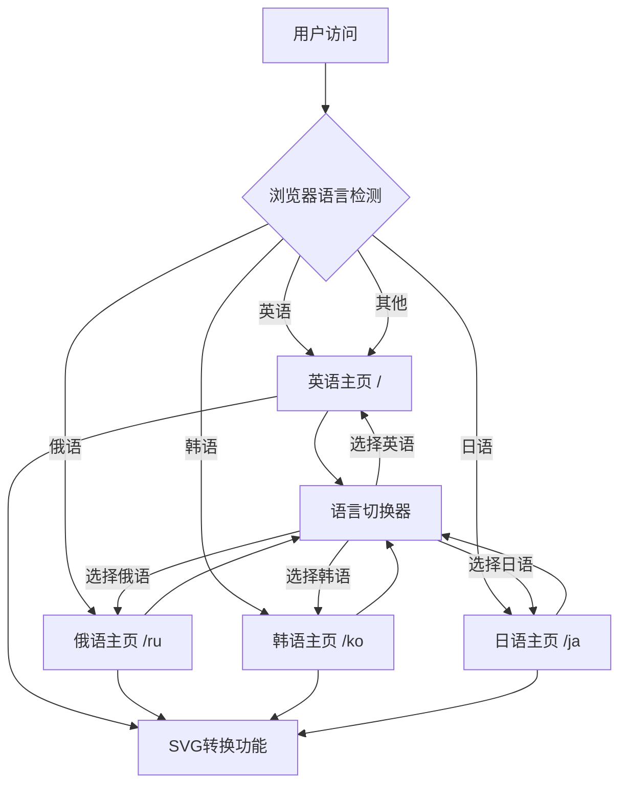

# 多语言扩展产品需求文档

## 1. 产品概述

本项目旨在为现有的SVG转ICO在线工具添加韩语和日语支持，扩大产品的国际化覆盖范围。当前产品已支持英语和俄语，具备完善的多语言架构基础。通过添加韩语和日语，产品将能够服务更广泛的亚洲用户群体，提升产品的市场竞争力和用户体验。

- 解决问题：满足韩国和日本用户的本地化需求，消除语言障碍
- 目标用户：韩国和日本的设计师、开发者、普通用户
- 产品价值：扩大市场覆盖范围，提升用户满意度，增强品牌国际化形象

## 2. 核心功能

### 2.1 用户角色

本产品不区分用户角色，所有用户均可使用完整功能。

### 2.2 功能模块

产品的核心页面结构保持不变，主要增强多语言支持：

1. **主页面**：SVG上传区域、转换选项设置、转换按钮、结果下载区域
2. **语言切换界面**：语言选择下拉菜单、当前语言显示

### 2.3 页面详情

| 页面名称 | 模块名称 | 功能描述 |
|----------|----------|----------|
| 主页面 | 页面标题和描述 | 显示韩语/日语的产品标题、副标题和功能描述 |
| 主页面 | 导航栏 | 提供韩语/日语的导航菜单项（功能、定价、常见问题等） |
| 主页面 | 文件上传区域 | 显示韩语/日语的上传提示文字、拖拽提示、文件格式说明 |
| 主页面 | 转换选项设置 | 提供韩语/日语的选项标签（质量、尺寸、背景等） |
| 主页面 | 转换按钮 | 显示韩语/日语的转换按钮文字和状态提示 |
| 主页面 | 进度显示 | 显示韩语/日语的转换进度文字和状态信息 |
| 主页面 | 结果下载 | 提供韩语/日语的下载按钮文字和操作提示 |
| 主页面 | 功能特性介绍 | 展示韩语/日语的产品特性说明和优势介绍 |
| 主页面 | 常见问题 | 提供韩语/日语的FAQ内容和解答 |
| 主页面 | 页脚信息 | 显示韩语/日语的版权信息、链接文字 |
| 语言切换 | 语言选择器 | 在现有英语、俄语基础上添加韩语、日语选项 |
| 语言切换 | 当前语言显示 | 显示韩国国旗🇰🇷和日本国旗🇯🇵，以及对应的语言名称 |

## 3. 核心流程

### 3.1 用户操作流程

**主要用户流程**：
1. 用户访问网站（自动检测浏览器语言或使用默认英语）
2. 用户可通过右上角语言切换器选择韩语或日语
3. 页面内容立即切换为对应语言
4. 用户使用SVG转ICO功能（界面为选择的语言）
5. 完成转换和下载（所有提示均为对应语言）

**语言切换流程**：
1. 用户点击语言切换按钮
2. 显示语言选择下拉菜单（英语、俄语、韩语、日语）
3. 用户选择目标语言
4. 页面重定向到对应语言版本
5. 所有界面文字切换为目标语言

### 3.2 页面导航流程图

## 4. 用户界面设计

### 4.1 设计风格

保持现有设计风格，确保新增语言的界面一致性：

- **主色调**：保持现有的蓝色主题 (#3B82F6) 和辅助色彩
- **按钮样式**：圆角按钮，保持现有的悬停效果和阴影
- **字体**：
  - 韩语：使用系统默认韩语字体或 Noto Sans KR
  - 日语：使用系统默认日语字体或 Noto Sans JP
  - 字体大小：保持现有的层级结构（标题、正文、说明文字）
- **布局风格**：保持现有的卡片式布局和顶部导航结构
- **图标样式**：添加韩国国旗🇰🇷和日本国旗🇯🇵 emoji图标

### 4.2 页面设计概览

| 页面名称 | 模块名称 | UI元素 |
|----------|----------|--------|
| 主页面 | 语言切换器 | 添加韩语选项（🇰🇷 한국어）和日语选项（🇯🇵 日本語），保持现有下拉菜单样式，圆角边框，白色背景，悬停高亮效果 |
| 主页面 | 页面标题 | 韩语/日语标题文字，保持现有的大字体、粗体、居中对齐样式 |
| 主页面 | 上传区域 | 韩语/日语提示文字，保持现有的虚线边框、拖拽区域样式、图标位置 |
| 主页面 | 选项设置 | 韩语/日语标签文字，保持现有的表单样式、选择器外观、间距布局 |
| 主页面 | 转换按钮 | 韩语/日语按钮文字，保持现有的蓝色背景、白色文字、圆角样式、点击动效 |
| 主页面 | 进度条 | 韩语/日语状态文字，保持现有的进度条样式、动画效果、颜色渐变 |
| 主页面 | 功能介绍 | 韩语/日语描述文字，保持现有的卡片布局、图标配色、文字层级 |
| 主页面 | 页脚 | 韩语/日语链接文字，保持现有的深色背景、浅色文字、链接样式 |

### 4.3 响应式设计

- **设计优先级**：桌面优先，移动端自适应
- **触摸优化**：语言切换器在移动端保持足够的点击区域
- **文字适配**：考虑韩语和日语文字长度差异，确保在不同屏幕尺寸下的良好显示
- **字体渲染**：确保韩语和日语字符在各种设备上的清晰显示

## 5. 翻译内容需求

### 5.1 韩语翻译需求

**翻译范围**：
- 网站标题和副标题
- 导航菜单项
- 功能说明文字
- 按钮和操作提示
- 错误和成功消息
- FAQ内容
- 页脚信息

**翻译要求**：
- 使用标准韩语（표준어）
- 考虑韩国用户的使用习惯
- 保持专业和友好的语调
- 技术术语使用通用的韩语表达

### 5.2 日语翻译需求

**翻译范围**：
- 网站标题和副标题
- 导航菜单项
- 功能说明文字
- 按钮和操作提示
- 错误和成功消息
- FAQ内容
- 页脚信息

**翻译要求**：
- 使用标准日语，适当使用敬语
- 考虑日本用户的使用习惯
- 保持礼貌和专业的语调
- 技术术语使用日本常用的表达方式
- 平假名、片假名、汉字的合理搭配

## 6. 技术要求

### 6.1 兼容性要求

- **浏览器支持**：Chrome 90+, Firefox 88+, Safari 14+, Edge 90+
- **设备支持**：桌面端、平板、手机
- **操作系统**：Windows, macOS, iOS, Android
- **字体支持**：确保韩语和日语字符正确显示

### 6.2 性能要求

- **加载速度**：翻译文件加载不影响页面首屏渲染时间
- **切换速度**：语言切换响应时间 < 500ms
- **文件大小**：单个翻译文件大小 < 50KB
- **缓存策略**：翻译文件支持浏览器缓存

### 6.3 SEO要求

- **URL结构**：
  - 韩语：`https://domain.com/ko/`
  - 日语：`https://domain.com/ja/`
- **Meta标签**：每种语言版本有对应的title、description
- **Hreflang标签**：正确配置语言和地区标识
- **结构化数据**：支持多语言的结构化数据标记

## 7. 验收标准

### 7.1 功能验收

- ✅ 语言切换器显示4种语言选项（英语、俄语、韩语、日语）
- ✅ 点击韩语选项，页面跳转到 `/ko` 路径，所有文字显示为韩语
- ✅ 点击日语选项，页面跳转到 `/ja` 路径，所有文字显示为日语
- ✅ 从韩语/日语页面可以正常切换回英语或俄语
- ✅ 所有功能模块（上传、转换、下载）在韩语/日语界面正常工作
- ✅ 错误提示和成功消息正确显示对应语言

### 7.2 界面验收

- ✅ 韩语和日语文字在各种屏幕尺寸下正确显示
- ✅ 文字长度变化不影响页面布局
- ✅ 国旗图标（🇰🇷🇯🇵）正确显示
- ✅ 字体渲染清晰，无乱码现象
- ✅ 响应式设计在移动端正常工作

### 7.3 性能验收

- ✅ 页面加载时间不超过现有版本的110%
- ✅ 语言切换响应时间 < 500ms
- ✅ 翻译文件正确缓存，重复访问速度快
- ✅ 无JavaScript错误或控制台警告

### 7.4 兼容性验收

- ✅ 在主流浏览器中正常工作
- ✅ 在不同操作系统中字体显示正常
- ✅ 移动端触摸操作流畅
- ✅ 现有英语和俄语功能不受影响

## 8. 风险评估

### 8.1 技术风险

- **低风险**：现有架构已支持多语言扩展
- **字体风险**：部分设备可能不支持韩语/日语字体显示
- **缓存风险**：用户可能需要清除浏览器缓存才能看到更新

### 8.2 内容风险

- **翻译质量**：需要专业翻译确保准确性和文化适应性
- **文字长度**：韩语/日语文字长度可能影响界面布局
- **文化差异**：需要考虑不同文化背景的用户习惯

### 8.3 业务风险

- **维护成本**：增加后续内容更新的工作量
- **用户期望**：用户可能期望更多本地化功能
- **竞争压力**：需要持续优化以保持竞争优势

## 9. 成功指标

### 9.1 使用指标

- 韩语版本月活跃用户 > 100
- 日语版本月活跃用户 > 100
- 语言切换成功率 > 99%
- 新语言版本转换成功率与英语版本持平

### 9.2 质量指标

- 页面加载时间增幅 < 10%
- 用户满意度评分 > 4.5/5
- 翻译准确性评分 > 4.5/5
- 零严重bug报告

### 9.3 业务指标

- 来自韩国的访问量增长 > 20%
- 来自日本的访问量增长 > 20%
- 整体用户留存率提升 > 5%
- 品牌国际化认知度提升

## 10. 项目时间线

### 10.1 开发阶段

- **第1天**：配置更新和组件修改（2-3小时）
- **第2-3天**：翻译内容准备和文件创建（6-8小时）
- **第4天**：功能测试和bug修复（4-6小时）
- **第5天**：最终验收和部署准备（2-3小时）

### 10.2 测试阶段

- **功能测试**：1天
- **兼容性测试**：1天
- **用户验收测试**：1天
- **性能测试**：0.5天

### 10.3 部署阶段

- **预生产部署**：0.5天
- **生产环境部署**：0.5天
- **监控和优化**：持续进行

**总预计时间**：5-7个工作日（不包括翻译准备时间）