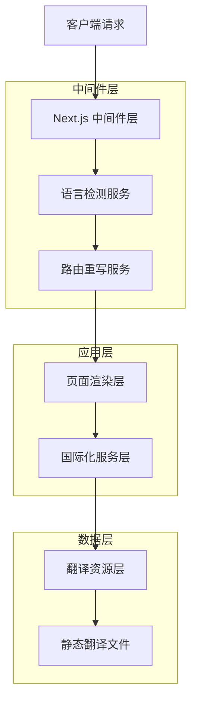
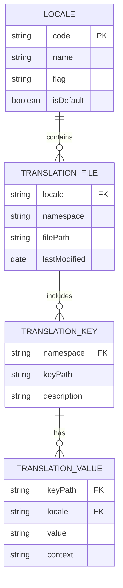

# 多语言扩展技术架构文档

## 1. 架构设计

```mermaid
graph TD
    A[用户浏览器] --> B[Next.js 中间件]
    B --> C[语言检测与路由]
    C --> D[动态路由 [locale]]
    D --> E[页面组件]
    E --> F[next-intl Hook]
    F --> G[翻译文件加载]
    G --> H[渲染多语言内容]
    
    I[语言切换组件] --> J[URL重定向]
    J --> B
    
    subgraph "前端层"
        A
        I
        E
    end
    
    subgraph "路由层"
        B
        C
        D
    end
    
    subgraph "国际化层"
        F
        G
        H
    end
    
    subgraph "翻译资源"
        K[messages/en.json]
        L[messages/ru.json]
        M[messages/ko.json - 新增]
        N[messages/ja.json - 新增]
    end
    
    G --> K
    G --> L
    G --> M
    G --> N
```

## 2. 技术描述

- **前端**: Next.js 14 + React 18 + TypeScript + Tailwind CSS
- **国际化**: next-intl + 动态路由
- **路由**: App Router + 中间件处理
- **状态管理**: React Hooks + 本地状态

## 3. 路由定义

### 3.1 当前路由结构
| 路由 | 语言 | 用途 |
|------|------|------|
| / | 英语(默认) | 主页面，SVG转ICO工具 |
| /ru | 俄语 | 俄语版本主页面 |

### 3.2 扩展后路由结构
| 路由 | 语言 | 用途 |
|------|------|------|
| / | 英语(默认) | 主页面，SVG转ICO工具 |
| /ru | 俄语 | 俄语版本主页面 |
| /ko | 韩语 | 韩语版本主页面 |
| /ja | 日语 | 日语版本主页面 |

## 4. API定义

### 4.1 核心国际化API

#### 语言检测API
```typescript
// 获取当前语言环境
const locale = useLocale();
// 返回: 'en' | 'ru' | 'ko' | 'ja'
```

#### 翻译API
```typescript
// 获取翻译函数
const t = useTranslations('namespace');
// 使用: t('key') 返回对应语言的翻译文本
```

#### 路由API
```typescript
// 获取路由信息
const router = useRouter();
const pathname = usePathname();
```

### 4.2 语言切换API

#### 语言切换函数
```typescript
interface LanguageChangeParams {
  targetLanguage: string;  // 目标语言代码
  currentUrl: string;      // 当前页面URL
}

interface LanguageChangeResponse {
  success: boolean;        // 切换是否成功
  targetUrl: string;       // 目标页面URL
  error?: string;          // 错误信息(如果有)
}

// 语言切换处理
function handleLanguageChange(params: LanguageChangeParams): LanguageChangeResponse
```

请求参数:
| 参数名 | 参数类型 | 是否必需 | 描述 |
|--------|----------|----------|------|
| targetLanguage | string | true | 目标语言代码 (en/ru/ko/ja) |
| currentUrl | string | true | 当前页面完整URL |

响应参数:
| 参数名 | 参数类型 | 描述 |
|--------|----------|------|
| success | boolean | 切换操作是否成功 |
| targetUrl | string | 重定向的目标URL |
| error | string? | 错误信息(可选) |

示例:
```json
{
  "targetLanguage": "ko",
  "currentUrl": "https://domain.com/ru"
}
```

响应:
```json
{
  "success": true,
  "targetUrl": "https://domain.com/ko"
}
```

## 5. 服务架构图



## 6. 数据模型

### 6.1 数据模型定义



### 6.2 数据定义语言

#### 语言环境配置
```typescript
// 语言环境定义
interface LocaleConfig {
  code: string;           // 语言代码 (ISO 639-1)
  name: string;           // 语言显示名称
  flag: string;           // 旗帜emoji
  isDefault: boolean;     // 是否为默认语言
  direction: 'ltr' | 'rtl'; // 文字方向
}

// 当前配置
const locales: LocaleConfig[] = [
  { code: 'en', name: 'English', flag: '🇺🇸', isDefault: true, direction: 'ltr' },
  { code: 'ru', name: 'Русский', flag: '🇷🇺', isDefault: false, direction: 'ltr' }
];

// 扩展后配置
const locales: LocaleConfig[] = [
  { code: 'en', name: 'English', flag: '🇺🇸', isDefault: true, direction: 'ltr' },
  { code: 'ru', name: 'Русский', flag: '🇷🇺', isDefault: false, direction: 'ltr' },
  { code: 'ko', name: '한국어', flag: '🇰🇷', isDefault: false, direction: 'ltr' },
  { code: 'ja', name: '日本語', flag: '🇯🇵', isDefault: false, direction: 'ltr' }
];
```

#### 翻译文件结构
```typescript
// 翻译文件接口定义
interface TranslationMessages {
  common: {
    language: string;
    home: string;
    features: string;
    pricing: string;
    about: string;
    contact: string;
  };
  nav: {
    features: string;
    pricing: string;
    faq: string;
    contact: string;
  };
  hero: {
    title: string;
    subtitle: string;
    description: string;
    uploadButton: string;
    dragDrop: string;
  };
  converter: {
    title: string;
    selectFile: string;
    processing: string;
    download: string;
    reset: string;
  };
  features: {
    title: string;
    items: Array<{
      title: string;
      description: string;
    }>;
  };
  footer: {
    copyright: string;
    privacy: string;
    terms: string;
  };
}
```

#### 路由配置
```typescript
// 路由配置定义
interface RoutingConfig {
  locales: string[];           // 支持的语言列表
  defaultLocale: string;       // 默认语言
  localePrefix: 'always' | 'as-needed' | 'never'; // URL前缀策略
  pathnames: Record<string, string | Record<string, string>>; // 路径名映射
}

// 当前路由配置
const routing: RoutingConfig = {
  locales: ['en', 'ru'],
  defaultLocale: 'en',
  localePrefix: 'never',
  pathnames: {
    '/': '/',
    '/about': {
      en: '/about',
      ru: '/o-nas'
    }
  }
};

// 扩展后路由配置
const routing: RoutingConfig = {
  locales: ['en', 'ru', 'ko', 'ja'],
  defaultLocale: 'en',
  localePrefix: 'never',
  pathnames: {
    '/': '/',
    '/about': {
      en: '/about',
      ru: '/o-nas',
      ko: '/about',  // 韩语保持英文路径
      ja: '/about'   // 日语保持英文路径
    }
  }
};
```

#### 中间件配置
```typescript
// 中间件匹配规则
interface MiddlewareConfig {
  matcher: string[];  // 路径匹配规则
}

// 当前中间件配置
const config: MiddlewareConfig = {
  matcher: [
    '/((?!api|_next/static|_next/image|favicon.ico).*)',
    '/',
    '/(ru|en)/:path*'
  ]
};

// 扩展后中间件配置
const config: MiddlewareConfig = {
  matcher: [
    '/((?!api|_next/static|_next/image|favicon.ico).*)',
    '/',
    '/(ru|en|ko|ja)/:path*'  // 添加韩语和日语支持
  ]
};
```

## 7. 实施计划

### 7.1 第一阶段：配置更新
**预计时间**: 2小时

1. **更新路由配置** (`src/i18n/routing.ts`)
   - 添加 'ko', 'ja' 到 locales 数组
   - 验证配置语法正确性

2. **更新中间件配置** (`middleware.ts`)
   - 修改 matcher 规则包含新语言
   - 测试路由匹配功能

### 7.2 第二阶段：组件更新
**预计时间**: 1小时

1. **更新语言切换组件** (`src/components/common/language-toggle.tsx`)
   - 添加韩语和日语到 languages 数组
   - 测试UI显示效果
   - 验证切换逻辑正确性

### 7.3 第三阶段：翻译文件创建
**预计时间**: 4-8小时(取决于翻译质量要求)

1. **创建韩语翻译文件** (`messages/ko.json`)
   - 复制英语文件结构
   - 翻译所有文本内容
   - 文化适应性调整

2. **创建日语翻译文件** (`messages/ja.json`)
   - 复制英语文件结构
   - 翻译所有文本内容
   - 敬语和文化适应性调整

### 7.4 第四阶段：测试验证
**预计时间**: 2-3小时

1. **功能测试**
   - 语言切换功能测试
   - URL路由正确性验证
   - 翻译内容显示测试

2. **兼容性测试**
   - 现有功能回归测试
   - 跨浏览器兼容性测试
   - 响应式设计测试

3. **性能测试**
   - 页面加载速度测试
   - 翻译文件加载效率测试
   - 语言切换响应时间测试

## 8. 质量保证

### 8.1 代码质量
- TypeScript 类型检查
- ESLint 代码规范检查
- 组件单元测试
- 集成测试覆盖

### 8.2 翻译质量
- 专业翻译人员审核
- 母语使用者校对
- 文化适应性评估
- 术语一致性检查

### 8.3 用户体验
- 语言切换流畅性
- UI元素适配性
- 文本长度适应
- 文化敏感性考虑

## 9. 部署和监控

### 9.1 部署策略
- 渐进式部署
- A/B测试支持
- 回滚机制准备
- 缓存清理策略

### 9.2 监控指标
- 语言使用分布统计
- 页面加载性能监控
- 错误率监控
- 用户行为分析

## 10. 维护和扩展

### 10.1 日常维护
- 翻译内容更新流程
- 新功能多语言支持
- 定期质量检查
- 用户反馈处理

### 10.2 未来扩展
- 更多语言支持准备
- 动态翻译加载
- 翻译管理系统集成
- 自动化翻译工具集成