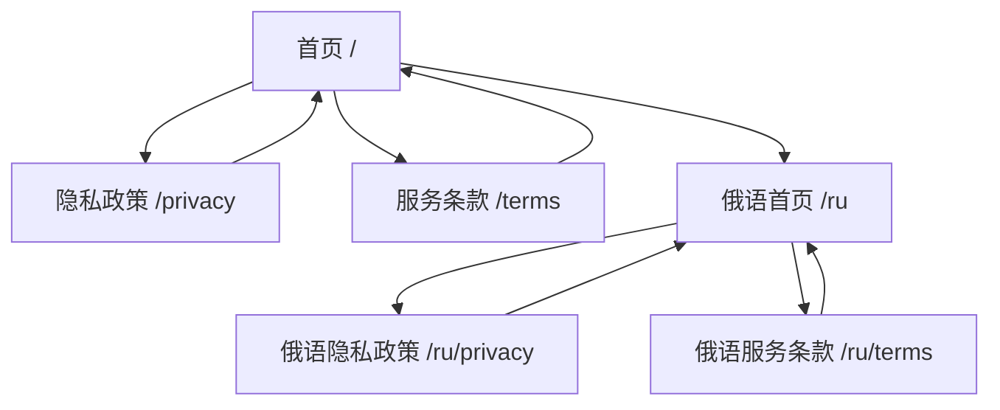
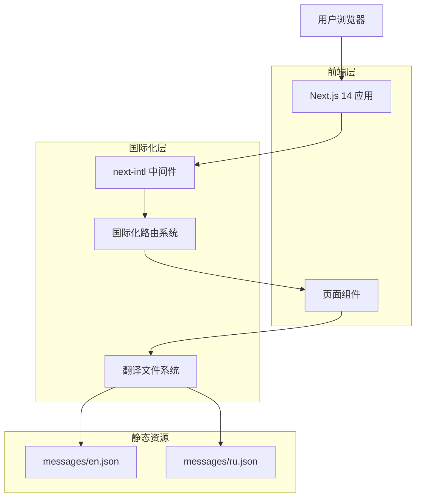
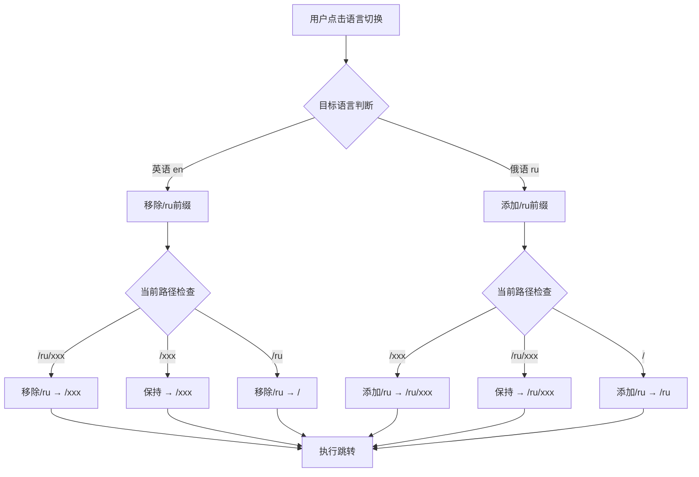

# SVG转ICO工具多语言技术架构文档

## 1. 产品概述

这是一个基于Next.js 14的SVG转ICO在线工具，支持英语和俄语两种语言。用户可以上传SVG文件并转换为ICO格式，同时提供完整的多语言用户界面。

## 2. 核心功能

### 2.1 用户角色

| 角色 | 注册方式 | 核心权限 |
|------|----------|----------|
| 普通用户 | 无需注册 | 可以使用SVG转ICO功能，浏览所有页面内容 |

### 2.2 功能模块

我们的SVG转ICO工具包含以下主要页面：

1. **首页**: 英雄区域、功能介绍、转换器组件、统计数据展示
2. **隐私政策页**: 隐私条款和数据处理说明
3. **服务条款页**: 使用条款和法律声明

### 2.3 页面详情

| 页面名称 | 模块名称 | 功能描述 |
|----------|----------|----------|
| 首页 | 英雄区域 | 展示产品标题、描述和主要行动按钮 |
| 首页 | 统计数据 | 显示转换次数、用户数量等关键指标 |
| 首页 | 转换器 | 提供SVG文件上传和ICO转换功能 |
| 首页 | 功能介绍 | 列出产品的主要特性和优势 |
| 首页 | 导航栏 | 包含语言切换、主题切换和页面导航 |
| 首页 | 页脚 | 显示版权信息和相关链接 |
| 隐私政策页 | 政策内容 | 展示完整的隐私政策条款 |
| 服务条款页 | 条款内容 | 展示使用条款和法律声明 |

## 3. 核心流程

### 3.1 用户操作流程

用户访问网站后，可以直接使用SVG转ICO功能。主要操作流程包括：
1. 访问首页，查看产品介绍
2. 上传SVG文件到转换器
3. 选择输出格式和尺寸
4. 下载转换后的ICO文件
5. 可以切换语言查看不同语言版本
6. 查看隐私政策和服务条款

### 3.2 页面导航流程图



## 4. 用户界面设计

### 4.1 设计风格

- **主色调**: 蓝色系 (#3B82F6) 和灰色系 (#6B7280)
- **次要色彩**: 绿色 (#10B981) 用于成功状态，红色 (#EF4444) 用于错误状态
- **按钮样式**: 圆角按钮，支持悬停和点击效果
- **字体**: 系统默认字体栈，支持多语言显示
- **布局风格**: 响应式卡片布局，顶部导航栏
- **图标风格**: 使用Lucide React图标库，简洁现代

### 4.2 页面设计概览

| 页面名称 | 模块名称 | UI元素 |
|----------|----------|--------|
| 首页 | 导航栏 | 深色背景，白色文字，语言切换按钮，主题切换按钮 |
| 首页 | 英雄区域 | 大标题，副标题，渐变背景，行动按钮 |
| 首页 | 统计数据 | 网格布局，数字突出显示，图标装饰 |
| 首页 | 转换器 | 拖拽上传区域，进度条，下载按钮 |
| 首页 | 功能列表 | 卡片布局，图标+文字描述 |
| 首页 | 页脚 | 简洁布局，链接和版权信息 |

### 4.3 响应式设计

产品采用移动优先的响应式设计，支持桌面端、平板和手机端访问。使用Tailwind CSS的响应式断点系统，确保在所有设备上都有良好的用户体验。

---

# 技术架构文档

## 1. 架构设计



## 2. 技术描述

- **前端**: Next.js 14 + React 18 + TypeScript + Tailwind CSS
- **国际化**: next-intl + 自定义路由配置
- **构建工具**: Next.js内置构建系统
- **部署**: 静态站点生成 (SSG)

## 3. 路由定义

| 路由 | 用途 |
|------|------|
| / | 英语首页，显示主要内容和SVG转换功能 |
| /ru | 俄语首页，显示俄语版本的主要内容 |
| /privacy | 英语隐私政策页面 |
| /ru/privacy | 俄语隐私政策页面 |
| /terms | 英语服务条款页面 |
| /ru/terms | 俄语服务条款页面 |

## 4. 国际化架构详解

### 4.1 文件结构

```
src/
├── app/
│   ├── layout.tsx                 # 根布局
│   └── [locale]/                  # 动态语言路由
│       ├── layout.tsx             # 语言布局
│       ├── page.tsx               # 首页
│       ├── privacy/
│       │   └── page.tsx           # 隐私政策页
│       └── terms/
│           └── page.tsx           # 服务条款页
├── components/
│   └── common/
│       └── language-toggle.tsx    # 语言切换组件
├── i18n/
│   └── routing.ts                 # 路由配置
├── messages/
│   ├── en.json                    # 英语翻译
│   └── ru.json                    # 俄语翻译
├── i18n.ts                        # 国际化配置
└── middleware.ts                  # 路由中间件
```

### 4.2 核心配置文件

#### 4.2.1 路由配置 (src/i18n/routing.ts)

```typescript
import { defineRouting } from 'next-intl/routing';

export const routing = defineRouting({
  locales: ['en', 'ru'],           // 支持的语言
  defaultLocale: 'en',             // 默认语言
  localePrefix: {
    mode: 'as-needed',             // 英语不显示前缀
    prefixes: {
      'ru': '/ru'                  // 俄语显示/ru前缀
    }
  },
  pathnames: {
    '/': '/',                      // 首页路径
    '/privacy': '/privacy',        // 隐私政策路径
    '/terms': '/terms'             // 服务条款路径
  }
});
```

#### 4.2.2 中间件配置 (middleware.ts)

```typescript
import createMiddleware from 'next-intl/middleware';
import { routing } from './src/i18n/routing';

export default createMiddleware(routing);

export const config = {
  matcher: [
    '/((?!api|_next|_vercel|.*\\..*).*)',  // 匹配所有页面路由
  ]
};
```

#### 4.2.3 国际化配置 (src/i18n.ts)

```typescript
import { notFound } from 'next/navigation';
import { getRequestConfig } from 'next-intl/server';
import { routing } from './i18n/routing';

export default getRequestConfig(async ({ locale }) => {
  // 验证语言是否支持
  if (!routing.locales.includes(locale as any)) {
    notFound();
  }

  return {
    messages: (await import(`../messages/${locale}.json`)).default
  };
});
```

### 4.3 语言切换组件架构

#### 4.3.1 组件设计原理

```typescript
// src/components/common/language-toggle.tsx
import { useLocale, useTranslations } from 'next-intl';
import { useRouter, usePathname } from 'next/navigation';

export function LanguageToggle() {
  const locale = useLocale();              // 获取当前语言
  const t = useTranslations('common');     // 获取翻译函数
  const router = useRouter();              // 路由控制
  const pathname = usePathname();          // 当前路径

  const handleLanguageChange = (newLocale: string) => {
    // 构建目标URL逻辑
    let targetUrl: string;
    
    if (newLocale === 'en') {
      // 英语：移除/ru前缀
      targetUrl = pathname.replace(/^\/ru/, '') || '/';
    } else {
      // 俄语：添加/ru前缀
      targetUrl = pathname.startsWith('/ru') 
        ? pathname 
        : `/ru${pathname}`;
    }
    
    // 执行跳转
    window.location.href = targetUrl;
  };

  return (
    // UI组件实现
  );
}
```

#### 4.3.2 URL构建逻辑



### 4.4 翻译文件架构

#### 4.4.1 文件结构设计

```json
// messages/en.json
{
  "nav": {
    "home": "Home",
    "privacy": "Privacy Policy",
    "terms": "Terms of Service"
  },
  "hero": {
    "title": "Convert SVG to ICO",
    "subtitle": "Fast, free, and easy SVG to ICO conversion"
  },
  "common": {
    "language": "Language",
    "theme": "Theme"
  }
}
```

```json
// messages/ru.json
{
  "nav": {
    "home": "Главная",
    "privacy": "Политика конфиденциальности",
    "terms": "Условия использования"
  },
  "hero": {
    "title": "Конвертировать SVG в ICO",
    "subtitle": "Быстрое, бесплатное и простое преобразование SVG в ICO"
  },
  "common": {
    "language": "Язык",
    "theme": "Тема"
  }
}
```

#### 4.4.2 翻译使用模式

```typescript
// 在组件中使用翻译
import { useTranslations } from 'next-intl';

export function HeroSection() {
  const t = useTranslations('hero');
  
  return (
    <section>
      <h1>{t('title')}</h1>
      <p>{t('subtitle')}</p>
    </section>
  );
}
```

## 5. 数据模型

### 5.1 语言配置模型

```typescript
// 语言配置类型定义
interface LocaleConfig {
  locales: string[];                    // 支持的语言列表
  defaultLocale: string;                // 默认语言
  localePrefix: {
    mode: 'as-needed' | 'always';       // 前缀模式
    prefixes: Record<string, string>;   // 语言前缀映射
  };
  pathnames: Record<string, string>;    // 路径名映射
}

// 翻译消息类型
interface Messages {
  nav: {
    home: string;
    privacy: string;
    terms: string;
  };
  hero: {
    title: string;
    subtitle: string;
  };
  common: {
    language: string;
    theme: string;
  };
  // ... 其他翻译分组
}
```

### 5.2 组件状态模型

```typescript
// 语言切换组件状态
interface LanguageToggleState {
  currentLocale: string;                // 当前语言
  availableLocales: string[];           // 可用语言列表
  isLoading: boolean;                   // 切换加载状态
  error?: string;                       // 错误信息
}

// 路由状态
interface RouteState {
  pathname: string;                     // 当前路径
  locale: string;                       // 当前语言
  targetUrl: string;                    // 目标URL
}
```

## 6. 性能优化策略

### 6.1 静态生成优化

```typescript
// 生成静态参数
export async function generateStaticParams() {
  return [
    { locale: 'en' },
    { locale: 'ru' }
  ];
}

// 页面级别的静态生成
export default async function Page({ 
  params: { locale } 
}: {
  params: { locale: string }
}) {
  // 页面内容
}
```

### 6.2 翻译文件优化

- **按需加载**: 只加载当前语言的翻译文件
- **构建时优化**: 在构建时预处理翻译文件
- **缓存策略**: 浏览器缓存翻译资源

### 6.3 路由优化

- **中间件缓存**: 缓存路由匹配结果
- **预加载**: 预加载可能访问的语言版本
- **SEO优化**: 为每种语言生成独立的sitemap

## 7. 错误处理和降级策略

### 7.1 语言检测失败处理

```typescript
// 语言验证和降级
function validateLocale(locale: string): string {
  const supportedLocales = ['en', 'ru'];
  
  if (supportedLocales.includes(locale)) {
    return locale;
  }
  
  // 降级到默认语言
  return 'en';
}
```

### 7.2 翻译缺失处理

```typescript
// 翻译键缺失时的降级策略
function getTranslation(key: string, locale: string): string {
  try {
    return t(key);
  } catch (error) {
    // 降级到英语翻译
    return getEnglishTranslation(key);
  }
}
```

### 7.3 路由错误处理

```typescript
// 路由跳转失败时的处理
function handleRouteError(error: Error, targetUrl: string) {
  console.error('Route navigation failed:', error);
  
  // 降级策略：使用简单的页面刷新
  window.location.replace(targetUrl);
}
```

## 8. 测试策略

### 8.1 单元测试

- 语言切换组件功能测试
- URL构建逻辑测试
- 翻译函数测试

### 8.2 集成测试

- 多语言路由测试
- 页面渲染测试
- 用户交互流程测试

### 8.3 端到端测试

- 完整的语言切换流程
- 不同设备上的响应式测试
- 性能和加载时间测试

---

**文档版本**: v1.0  
**创建时间**: 2025-01-18  
**维护者**: 开发团队  
**更新频率**: 随功能更新