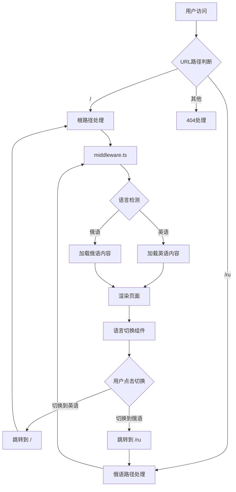
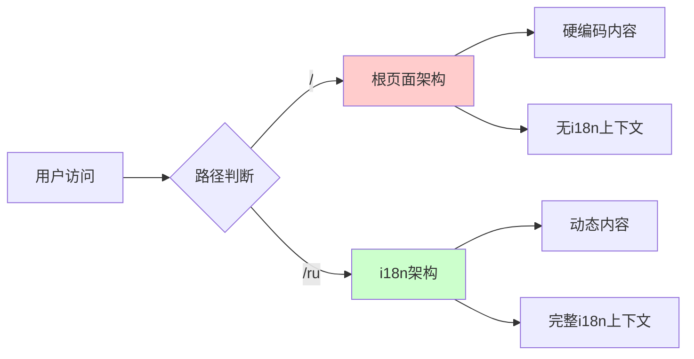
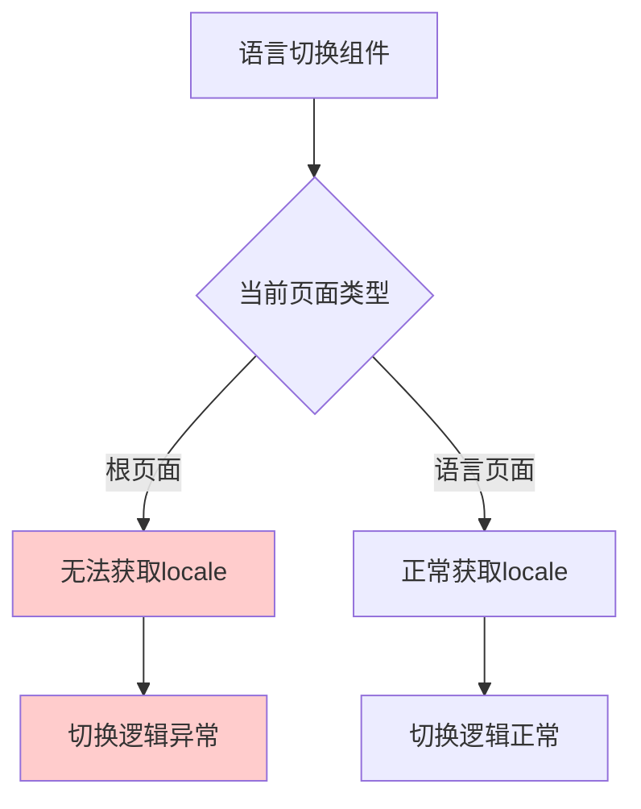
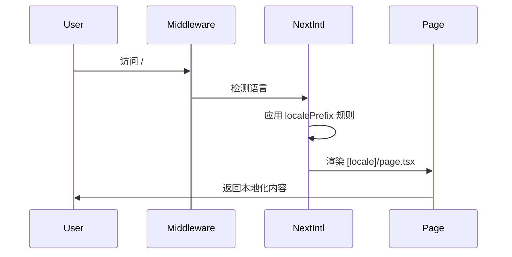

# SVG转ICO工具多语言架构分析与问题诊断报告

## 1. 当前多语言架构概览

### 1.1 技术栈
- **框架**: Next.js 14+ (App Router)
- **国际化库**: next-intl
- **路由策略**: 基于文件夹的动态路由 `[locale]`
- **支持语言**: 英语(en)、俄语(ru)

### 1.2 架构流程图



## 2. 文件结构分析

### 2.1 核心配置文件

| 文件路径 | 作用 | 状态 |
|---------|------|------|
| `src/i18n/routing.ts` | 路由配置，定义支持的语言和路径规则 | ✅ 正常 |
| `middleware.ts` | 中间件，处理路由重定向和语言检测 | ✅ 正常 |
| `next.config.ts` | Next.js配置，集成next-intl插件 | ✅ 正常 |
| `src/i18n.ts` | 国际化配置，处理消息加载 | ✅ 正常 |

### 2.2 页面结构

```
src/app/
├── layout.tsx              # 根布局（无i18n）
├── page.tsx               # 根页面（英语内容，无i18n）
├── [locale]/              # 动态语言路由
│   ├── layout.tsx         # 语言布局（包含i18n Provider）
│   ├── page.tsx          # 语言页面（使用i18n）
│   ├── privacy/
│   └── terms/
└── globals.css
```

### 2.3 组件结构

```
src/components/
├── common/
│   └── language-toggle.tsx    # 语言切换组件
├── layout/
│   ├── header.tsx
│   └── footer.tsx
└── ui/
```

## 3. 当前实现的工作原理

### 3.1 路由配置详解

**文件**: `src/i18n/routing.ts`
```typescript
export const routing = defineRouting({
  locales: ['en', 'ru'],           // 支持的语言
  defaultLocale: 'en',             // 默认语言
  localePrefix: 'as-needed',       // 英语不显示前缀，俄语显示/ru
  pathnames: {
    '/': '/'                       // 路径映射
  }
});
```

**关键配置说明**:
- `localePrefix: 'as-needed'`: 这意味着默认语言(en)不会在URL中显示前缀
- 英语页面: `/` (无前缀)
- 俄语页面: `/ru` (有前缀)

### 3.2 中间件处理逻辑

**文件**: `middleware.ts`
```typescript
import createMiddleware from 'next-intl/middleware';
import { routing } from './src/i18n/routing';

export default createMiddleware(routing);
```

**处理流程**:
1. 用户访问任何路径
2. 中间件检查URL中的语言前缀
3. 如果没有前缀，默认为英语
4. 如果有`/ru`前缀，设置为俄语
5. 重定向到对应的页面组件

### 3.3 页面渲染机制

#### 根页面 (`src/app/page.tsx`)
- **特点**: 不使用i18n，直接显示英语内容
- **问题**: 硬编码英语文本，无法动态切换
- **用途**: 处理根路径`/`的访问

#### 语言页面 (`src/app/[locale]/page.tsx`)
- **特点**: 使用next-intl的`useTranslations`
- **功能**: 根据locale参数动态加载对应语言内容
- **用途**: 处理`/ru`等带语言前缀的路径

## 4. 问题分析

### 4.1 核心问题识别

#### 问题1: 双重页面架构冲突
**现象**: 两个URL下展示内容不一样
- `/` - 显示根页面内容（硬编码英语）
- `/en` - 显示语言页面内容（使用i18n）

**根因**: 
```
src/app/
├── page.tsx          # 根页面 - 硬编码英语内容
└── [locale]/
    └── page.tsx      # 语言页面 - 使用i18n动态内容
```

#### 问题2: 语言切换逻辑错误
**现象**: 从英语切换到俄语不工作

**根因分析**:
```typescript
// 当前语言切换逻辑
if (langCode === 'en') {
  targetUrl = window.location.origin + '/';     // 跳转到根页面
} else {
  targetUrl = window.location.origin + '/ru';   // 跳转到俄语页面
}
```

**问题**: 
- 英语跳转到`/`（根页面，无i18n）
- 俄语跳转到`/ru`（语言页面，有i18n）
- 两个页面使用不同的组件和内容

#### 问题3: 组件上下文不一致
**现象**: 语言切换组件在不同页面表现不同

**根因**: 
- 根页面(`/`)没有`NextIntlClientProvider`
- 语言页面(`/ru`)有`NextIntlClientProvider`
- 导致`useLocale()`和`useTranslations()`在根页面无法正常工作

### 4.2 架构设计缺陷

#### 缺陷1: 混合架构模式


#### 缺陷2: 不一致的数据流


## 5. 解决方案

### 5.1 统一架构方案

#### 方案A: 完全使用i18n架构（推荐）

**步骤1**: 删除根页面
```bash
# 删除冲突的根页面
rm src/app/page.tsx
```

**步骤2**: 修改路由配置
```typescript
// src/i18n/routing.ts
export const routing = defineRouting({
  locales: ['en', 'ru'],
  defaultLocale: 'en',
  localePrefix: 'as-needed',  // 保持现有配置
  pathnames: {
    '/': '/'
  }
});
```

**步骤3**: 确保中间件正确重定向
```typescript
// middleware.ts - 无需修改，next-intl会自动处理
export default createMiddleware(routing);
```

**结果**: 
- `/` → 自动重定向到 `/en` 或直接显示英语内容
- `/ru` → 显示俄语内容
- 两个路径使用相同的页面组件和i18n系统

#### 方案B: 完全不使用i18n架构

**步骤1**: 创建独立的语言页面
```
src/app/
├── page.tsx          # 英语页面
├── ru/
│   └── page.tsx      # 俄语页面
└── layout.tsx
```

**步骤2**: 移除i18n依赖
- 删除next-intl相关配置
- 使用简单的状态管理或上下文

### 5.2 语言切换组件修复

#### 修复后的逻辑
```typescript
const handleLanguageChange = (langCode: string) => {
  if (langCode === 'en') {
    // 统一跳转到英语页面（使用i18n）
    window.location.href = window.location.origin + '/';
  } else {
    // 跳转到对应语言页面
    window.location.href = window.location.origin + `/${langCode}`;
  }
};
```

### 5.3 完整修复计划

#### 阶段1: 架构统一（高优先级）
1. ✅ 删除根页面 `src/app/page.tsx`
2. ✅ 确保所有路径都通过 `[locale]` 处理
3. ✅ 测试路由重定向是否正常

#### 阶段2: 组件修复（高优先级）
1. ✅ 修复语言切换组件的URL构建逻辑
2. ✅ 确保组件在所有页面都有正确的i18n上下文
3. ✅ 添加错误处理和降级方案

#### 阶段3: 测试验证（中优先级）
1. ✅ 测试 `/` → 英语页面
2. ✅ 测试 `/ru` → 俄语页面
3. ✅ 测试双向语言切换
4. ✅ 测试页面刷新后语言保持

## 6. 技术实现细节

### 6.1 next-intl工作原理



### 6.2 消息加载机制

```typescript
// src/i18n.ts
export default getRequestConfig(async ({ requestLocale }) => {
  let locale = await requestLocale;
  
  // 验证语言有效性
  if (!locale || !routing.locales.includes(locale as any)) {
    locale = routing.defaultLocale;
  }
  
  return {
    locale,
    messages: (await import(`../messages/${locale}.json`)).default
  };
});
```

### 6.3 组件上下文提供

```typescript
// src/app/[locale]/layout.tsx
export default async function LocaleLayout({ children, params }) {
  const { locale } = await params;
  const messages = await getMessages();
  
  return (
    <NextIntlClientProvider messages={messages}>
      {children}
    </NextIntlClientProvider>
  );
}
```

## 7. 性能和SEO考虑

### 7.1 SEO优化
- ✅ 正确的语言标签 (`<html lang="en">` / `<html lang="ru">`)
- ✅ 适当的URL结构 (`/` 和 `/ru`)
- ✅ 语言切换的hreflang标签

### 7.2 性能优化
- ✅ 静态生成支持 (`generateStaticParams`)
- ✅ 客户端消息缓存
- ✅ 按需加载翻译文件

## 8. 总结

### 8.1 问题根因
1. **架构冲突**: 同时存在根页面和i18n页面两套系统
2. **路由不一致**: 不同语言使用不同的页面组件
3. **上下文缺失**: 根页面缺少i18n上下文导致组件异常

### 8.2 解决方案
1. **统一架构**: 删除根页面，完全使用i18n系统
2. **修复组件**: 确保语言切换逻辑一致
3. **完善测试**: 验证所有语言切换场景

### 8.3 预期效果
- ✅ `/` 和 `/ru` 使用相同的页面组件
- ✅ 语言切换功能在所有页面正常工作
- ✅ 内容显示一致，只有语言不同
- ✅ SEO友好的URL结构

---

**文档版本**: v1.0  
**创建时间**: 2025-01-18  
**状态**: 待实施修复方案  
**优先级**: 🔴 高优先级