# SVG转ICO工具多语言系统架构图解

## 1. 当前架构问题可视化

### 1.1 现有架构的混乱状态

```mermaid
graph TB
    subgraph "用户访问路径"
        A[用户访问 /] 
        B[用户访问 /ru]
    end
    
    subgraph "问题架构 - 双重系统"
        C[根页面系统]
        D[i18n语言系统]
    end
    
    subgraph "根页面系统 (有问题)"
        E[src/app/page.tsx]
        F[硬编码英语内容]
        G[无i18n上下文]
        H[语言切换组件异常]
    end
    
    subgraph "i18n语言系统 (正常)"
        I[src/app/[locale]/page.tsx]
        J[动态多语言内容]
        K[完整i18n上下文]
        L[语言切换组件正常]
    end
    
    A --> C
    B --> D
    C --> E
    C --> F
    C --> G
    C --> H
    D --> I
    D --> J
    D --> K
    D --> L
    
    style C fill:#ffcccc,stroke:#ff0000,stroke-width:3px
    style E fill:#ffcccc
    style F fill:#ffcccc
    style G fill:#ffcccc
    style H fill:#ffcccc
    style D fill:#ccffcc,stroke:#00ff00,stroke-width:3px
    style I fill:#ccffcc
    style J fill:#ccffcc
    style K fill:#ccffcc
    style L fill:#ccffcc
```

### 1.2 语言切换失败的数据流

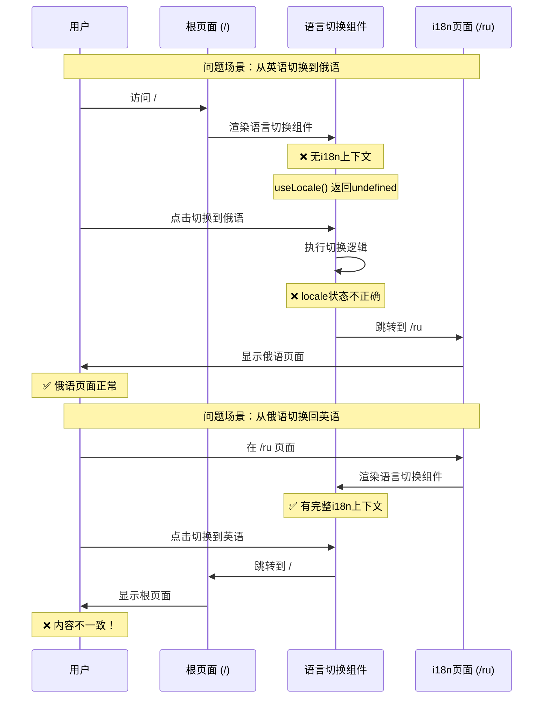

### 1.3 组件上下文问题图解

```mermaid
graph LR
    subgraph "根页面 (/) - 问题区域"
        A[src/app/page.tsx]
        B[src/app/layout.tsx]
        C[LanguageToggle组件]
        
        A --> C
        B --> A
        
        D[❌ 无NextIntlClientProvider]
        E[❌ useLocale() = undefined]
        F[❌ useTranslations() 报错]
        
        B -.-> D
        C -.-> E
        C -.-> F
    end
    
    subgraph "语言页面 (/ru) - 正常区域"
        G[src/app/[locale]/page.tsx]
        H[src/app/[locale]/layout.tsx]
        I[LanguageToggle组件]
        
        G --> I
        H --> G
        
        J[✅ 有NextIntlClientProvider]
        K[✅ useLocale() = 'ru']
        L[✅ useTranslations() 正常]
        
        H -.-> J
        I -.-> K
        I -.-> L
    end
    
    style A fill:#ffcccc
    style B fill:#ffcccc
    style C fill:#ffcccc
    style D fill:#ffcccc
    style E fill:#ffcccc
    style F fill:#ffcccc
    
    style G fill:#ccffcc
    style H fill:#ccffcc
    style I fill:#ccffcc
    style J fill:#ccffcc
    style K fill:#ccffcc
    style L fill:#ccffcc
```

## 2. 解决方案架构设计

### 2.1 统一架构方案

```mermaid
graph TB
    subgraph "用户访问"
        A[用户访问 /]
        B[用户访问 /ru]
    end
    
    subgraph "中间件处理"
        C[middleware.ts]
        D[next-intl路由处理]
    end
    
    subgraph "统一i18n系统"
        E[src/app/[locale]/layout.tsx]
        F[src/app/[locale]/page.tsx]
        G[NextIntlClientProvider]
        H[完整i18n上下文]
    end
    
    subgraph "组件层"
        I[LanguageToggle组件]
        J[Header组件]
        K[Footer组件]
    end
    
    A --> C
    B --> C
    C --> D
    D --> E
    E --> F
    E --> G
    G --> H
    F --> I
    F --> J
    F --> K
    
    style E fill:#ccffcc,stroke:#00ff00,stroke-width:2px
    style F fill:#ccffcc,stroke:#00ff00,stroke-width:2px
    style G fill:#ccffcc,stroke:#00ff00,stroke-width:2px
    style H fill:#ccffcc,stroke:#00ff00,stroke-width:2px
    style I fill:#ccffcc,stroke:#00ff00,stroke-width:2px
```

### 2.2 修复后的语言切换流程

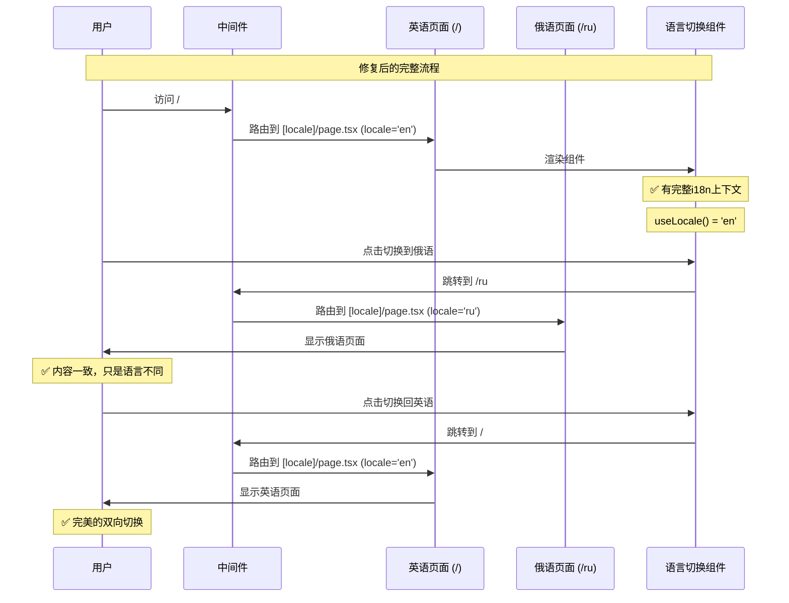

### 2.3 文件结构重组

```mermaid
graph LR
    subgraph "修复前 - 混乱结构"
        A[src/app/]
        B[page.tsx ❌]
        C[layout.tsx]
        D[[locale]/]
        E[layout.tsx]
        F[page.tsx]
        
        A --> B
        A --> C
        A --> D
        D --> E
        D --> F
        
        style B fill:#ffcccc,stroke:#ff0000
    end
    
    subgraph "修复后 - 清晰结构"
        G[src/app/]
        H[layout.tsx]
        I[[locale]/]
        J[layout.tsx]
        K[page.tsx]
        L[privacy/]
        M[terms/]
        
        G --> H
        G --> I
        I --> J
        I --> K
        I --> L
        I --> M
        
        style G fill:#ccffcc,stroke:#00ff00
        style H fill:#ccffcc,stroke:#00ff00
        style I fill:#ccffcc,stroke:#00ff00
        style J fill:#ccffcc,stroke:#00ff00
        style K fill:#ccffcc,stroke:#00ff00
    end
```

## 3. 数据流架构图

### 3.1 i18n数据流

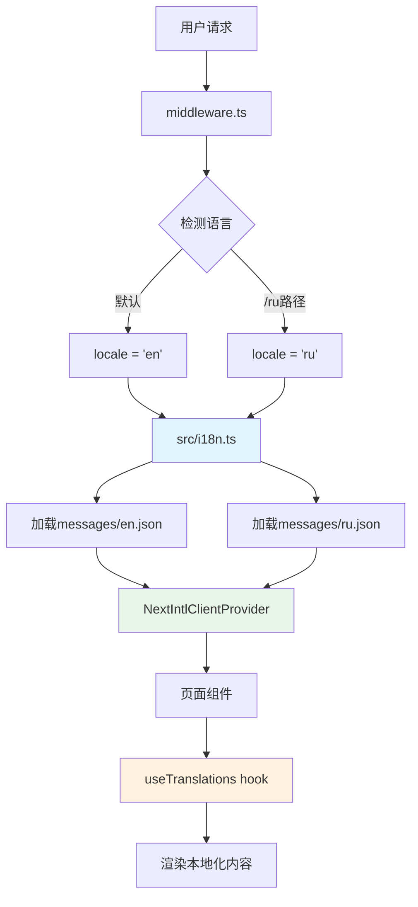

### 3.2 语言切换数据流

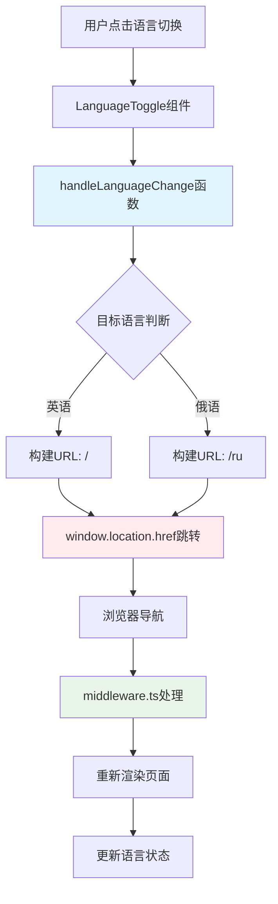

## 4. 组件交互架构

### 4.1 组件层次结构

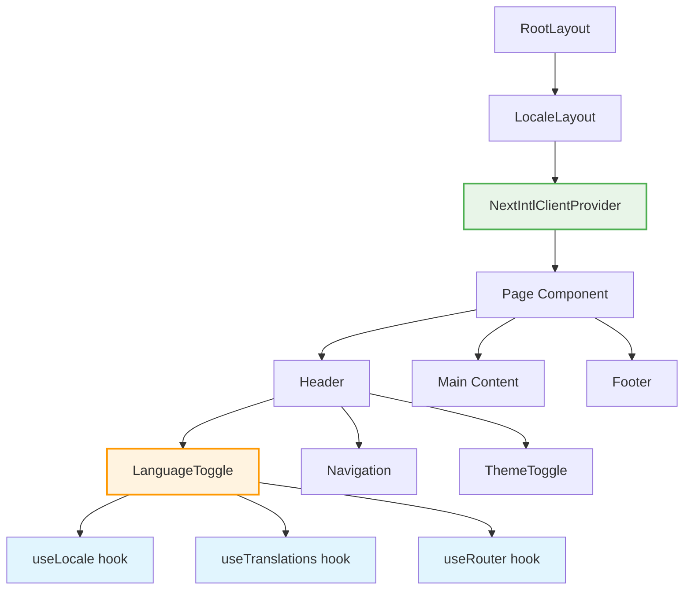

### 4.2 Hook依赖关系

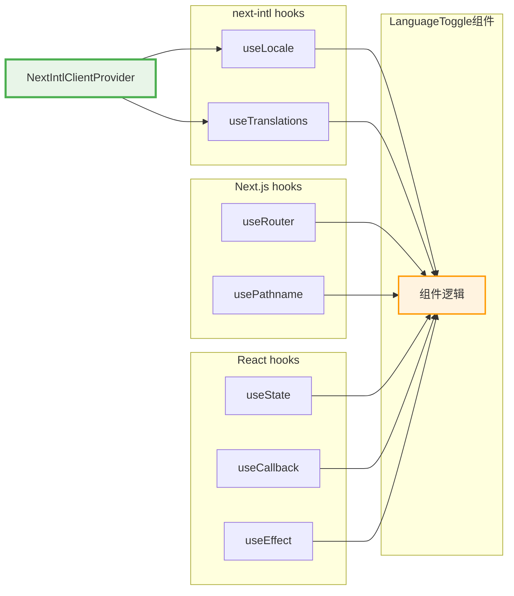

## 5. 错误处理架构

### 5.1 错误场景处理流程

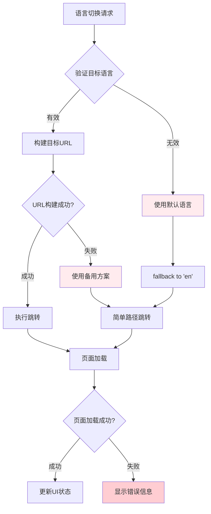

### 5.2 降级策略

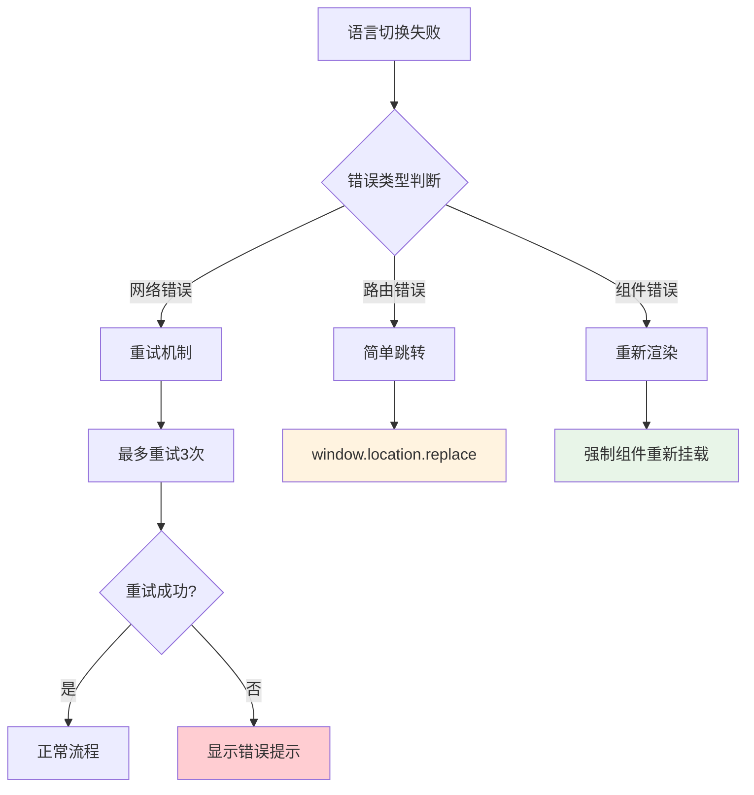

## 6. 性能优化架构

### 6.1 静态生成策略

```mermaid
graph LR
    A[构建时] --> B[generateStaticParams]
    B --> C[生成语言参数]
    C --> D[预渲染页面]
    
    D --> E[/en页面]
    D --> F[/ru页面]
    
    E --> G[静态HTML]
    F --> H[静态HTML]
    
    G --> I[CDN缓存]
    H --> I
    
    style B fill:#e8f5e8
    style I fill:#e1f5fe
```

### 6.2 客户端缓存策略

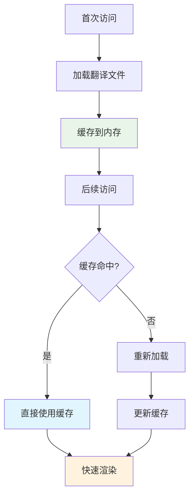

## 7. 总结

### 7.1 问题根源可视化

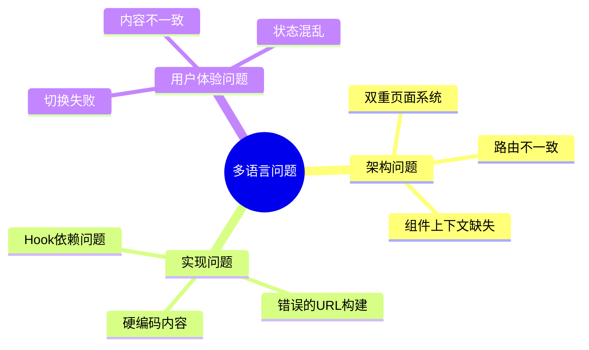

### 7.2 解决方案概览

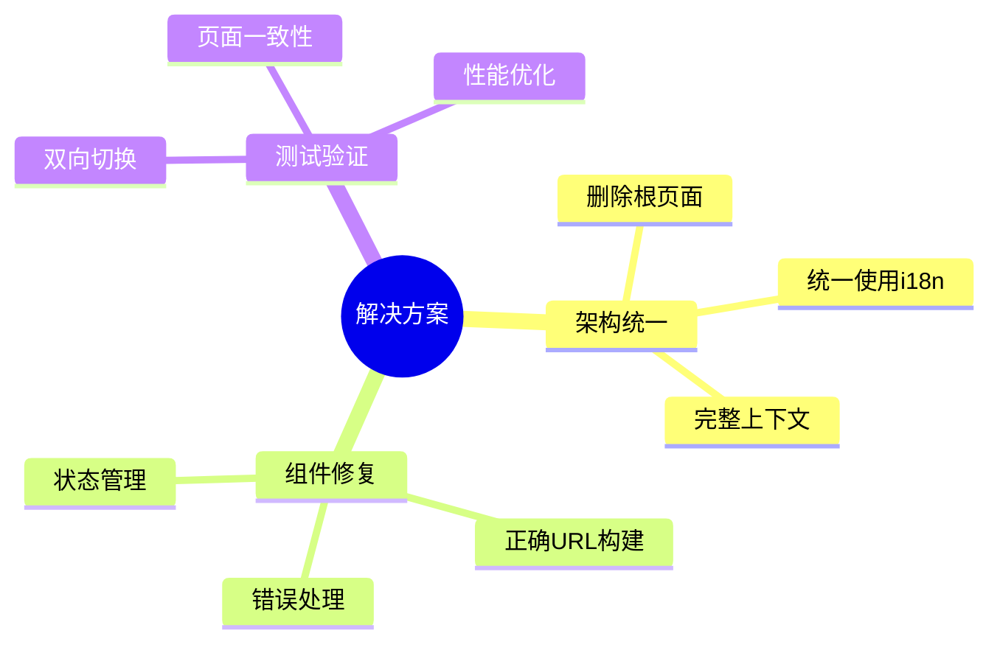

---

**文档版本**: v1.0  
**创建时间**: 2025-01-18  
**用途**: 架构可视化和问题诊断  
**状态**: 分析完成，待实施修复